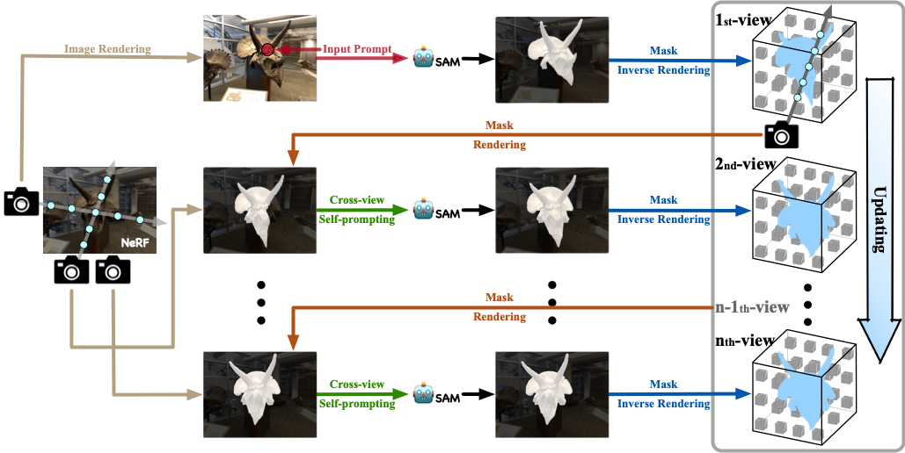
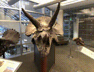
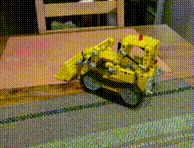
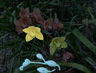

# Segment Anything🤖️ in 3D with NeRFs (SA3D)
### [Project Page](https://jumpat.github.io/SA3D/) | [Arxiv Paper](https://arxiv.org/abs/2304.12308)

[Segment Anything in 3D with NeRFs](https://arxiv.org/abs/2304.12308)  
[Jiazhong Cen](https://github.com/Jumpat)\*<sup>1</sup>, [Zanwei Zhou](https://github.com/Zanue)\*<sup>1</sup>, [Jiemin Fang](https://jaminfong.cn/)<sup>2</sup>, [Chen Yang](https://github.com/chensjtu)<sup>1</sup>, [Wei Shen](https://shenwei1231.github.io/)<sup>1✉</sup>, [Lingxi Xie](http://lingxixie.com/)<sup>3</sup>, [Dongsheng Jiang](https://sites.google.com/site/dongshengjiangbme/)<sup>3</sup>, [Xiaopeng Zhang](https://sites.google.com/site/zxphistory/)<sup>3</sup>, [Qi Tian](https://scholar.google.com/citations?hl=en&user=61b6eYkAAAAJ)<sup>3</sup>   
<sup>1</sup>AI Institute, SJTU &emsp; <sup>2</sup>School of EIC, HUST &emsp; <sup>3</sup>Huawei Inc.  
\*denotes equal contribution  

*Given a NeRF, just input prompts from **one single view** and then get your 3D model.*   


We propose a novel framework to Segment Anything in 3D, named <b>SA3D</b>. Given a neural radiance field (NeRF) model, SA3D allows users to obtain the 3D segmentation result of any target object via only <b>one-shot</b> manual prompting in a single rendered view. The entire process for obtaining the target 3D model can be completed in approximately 2 minutes, yet without any engineering optimization. Our experiments demonstrate the effectiveness of SA3D in different scenes, highlighting the potential of SAM in 3D scene perception. 


## Overall Pipeline



With input prompts, SAM cuts out the target object from the according view. The obtained 2D segmentation mask is projected onto 3D mask grids via density-guided inverse rendering. 2D masks from other views are then rendered, which are mostly uncompleted but used as cross-view self-prompts to be fed into SAM again. Complete masks can be obtained and projected onto mask grids. This procedure is executed via an iterative manner while accurate 3D masks can be finally learned. SA3D can adapt to various radiance fields effectively without any additional redesigning.


## Installation

```
git clone https://github.com/Jumpat/SegmentAnythingin3D.git
cd SegmentAnythingin3D

conda create -n sa3d python=3.10
pip install -r requirements.txt
```

### SAM and Grounding-DINO:

```
# Installing SAM
mkdir dependencies; cd dependencies 
mkdir sam_ckpt; cd sam_ckpt
wget https://dl.fbaipublicfiles.com/segment_anything/sam_vit_h_4b8939.pth
git clone git@github.com:facebookresearch/segment-anything.git 
cd segment-anything; pip install -e .

# Installing Grounding-DINO
git clone https://github.com/IDEA-Research/GroundingDINO.git
cd GroundingDINO/; pip install -e .
mkdir weights; cd weights
wget https://github.com/IDEA-Research/GroundingDINO/releases/download/v0.1.0-alpha/groundingdino_swint_ogc.pth
```

## Download Data
We now release the configs on these datasets:
* *Foward-facing:* [LLFF](https://drive.google.com/drive/folders/14boI-o5hGO9srnWaaogTU5_ji7wkX2S7) 
* *Inward-facing:* [mip-NeRF360](https://jonbarron.info/mipnerf360/), [LERF](https://www.lerf.io/)

### Data structure:  
<details>
  <summary> (click to expand) </summary>

    data
    ├── 360_v2             # Link: https://jonbarron.info/mipnerf360/
    │   └── [bicycle|bonsai|counter|garden|kitchen|room|stump]
    │       ├── poses_bounds.npy
    │       └── [images|images_2|images_4|images_8]
    │
    ├── nerf_llff_data     # Link: https://drive.google.com/drive/folders/14boI-o5hGO9srnWaaogTU5_ji7wkX2S7
    │   └── [fern|flower|fortress|horns|leaves|orchids|room|trex]
    │       ├── poses_bounds.npy
    │       └── [images|images_2|images_4|images_8]
    │
    └── lerf_data               # Link: https://drive.google.com/drive/folders/1vh0mSl7v29yaGsxleadcj-LCZOE_WEWB
        └── [book_store|bouquet|donuts|...]
            ├── transforms.json
            └── [images|images_2|images_4|images_8]
</details>

## Usage
- Train NeRF
  ```bash
  python run.py --config=configs/llff/fern.py --stop_at=20000 --render_video --i_weights=10000
  ```
- Run SA3D in GUI
  ```bash
  python run_seg_gui.py --config=configs/llff/seg/seg_fern.py --segment \
  --sp_name=_gui --num_prompts=20 \
  --render_opt=train --save_ckpt
  ```
- Render and Save Videos
  ```bash
  python run_seg_gui.py --config=configs/llff/seg/seg_fern.py --segment \
  --sp_name=_gui --num_prompts=20 \
  --render_test --render_opt=video --dump_images \
  --seg_type seg_img seg_density
  ```

Some tips when run SA3D:
- Increase `--num_prompts` when the target object is extremely irregular like LLFF scenes *Fern* and *Trex*;
- Use `--seg_poses` to specify the camera pose sequence used for training 3D mask, `default='train', choices=['train', 'video']`.

Using our [Dash](https://github.com/plotly/dash.git) based GUI:

- Select which type of prompt to be used, currently support: *Point Prompt* and *Text Prompt*;
  - *Point Prompt:* select `Points` in the drop down; click the original image to add a point prompt, then SAM will produce candidate masks; click `Clear Points` to clear out the previous inputs;
  - *Text Prompt:* select `Text` in the drop down;input your text prompt and click `Generate` to get candidate masks; note that unreasonable text input may cause error.
- Select your target mask;
- Press `Start Training` to run SA3D; we visualize rendered masks and SAM predictions produced by our cross-view self-prompting stategy;
- Wait a few minutes to see the final rendering results.

# TODO List
- [ ] Refine the GUI, *e.g.*, start from any train view, add more training hyper-parameter options, etc.;
- [ ] Support the two-pass stage in GUI; currently it may have some bugs.

## Some Visualization Samples

SA3D can handle various scenes for 3D segmentation. Find more demos in our [project page](https://jumpat.github.io/SA3D/).

| Forward facing | 360° | Multi-objects |
| :---: | :---:| :---:|
| |  | 

## Acknowledgements
Thanks for the following project for their valuable contributions:
- [Segment Anything](https://github.com/facebookresearch/segment-anything)
- [DVGO](https://github.com/sunset1995/DirectVoxGO)
- [Grounding DINO](https://github.com/IDEA-Research/GroundingDINO.git)

## Citation
If you find this project helpful for your research, please consider citing the report and giving a ⭐.
```BibTex
@article{cen2023segment,
      title={Segment Anything in 3D with NeRFs}, 
      author={Jiazhong Cen and Zanwei Zhou and Jiemin Fang and Wei Shen and Lingxi Xie and Xiaopeng Zhang and Qi Tian},
      journal={arXiv:2304.12308},
      year={2023}
}
```
